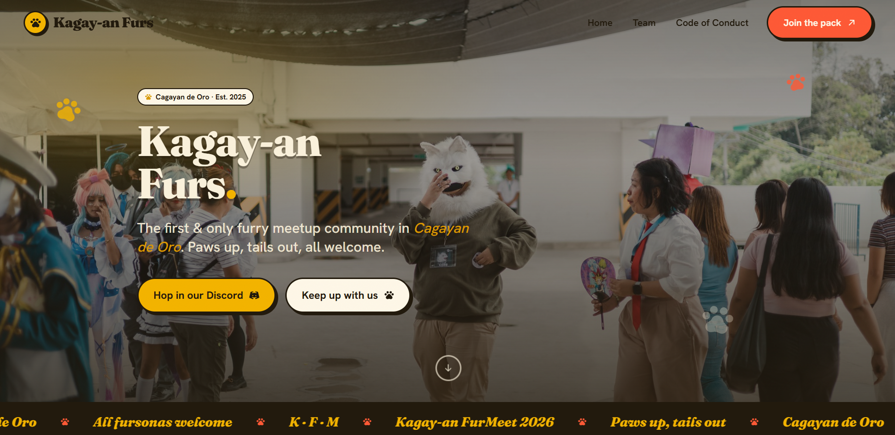

# Kagay-an Furs · SvelteKit

> **This is a fork.** The original project belongs to the
> [Kagay-an Furs organization](https://github.com/Kagay-an-Furs/website-v2).
> I forked it and rebuilt the front end in **SvelteKit + TypeScript**, then gave
> it a fresh visual design.



The marketing site for **Kagay-an Furs (KFM)**, the first and only furry meetup
community in Cagayan de Oro.

## ⚠️ Ownership & credits

I only own the **code** in this repository (see [LICENSE](LICENSE)).

Everything else is **not mine**:

- The **Kagay-an Furs** name, branding and logo belong to the
  [Kagay-an Furs community](https://github.com/Kagay-an-Furs).
- All **photos, member images, event artwork and other media** under
  `src/lib/assets/` and `static/` belong to their respective owners. They are
  included here only because this is a fork of the original project and are
  **not** covered by this repository's license.

If you are a rights holder and want any asset removed, please open an issue.

## Tech stack

- [SvelteKit](https://svelte.dev/docs/kit) (Svelte 5 runes) + **TypeScript**
- [Tailwind CSS v4](https://tailwindcss.com/) with a custom design system
- [phosphor-svelte](https://github.com/haruaki07/phosphor-svelte) for icons
- [`@sveltejs/adapter-vercel`](https://svelte.dev/docs/kit/adapter-vercel) for deployment
- [Vite](https://vite.dev/) + [pnpm](https://pnpm.io/)

## Getting started

```bash
pnpm install      # install dependencies
pnpm dev          # start the dev server (http://localhost:5173)
pnpm build        # production build
pnpm preview      # preview the production build
pnpm check        # type-check with svelte-check
```

## Project structure

```
src/
  app.html            # document shell + fonts
  app.css             # design system (tokens, components, animations)
  lib/
    components/       # Header, Hero, Footer, Event(Card), TeamCard, Marquee
    actions/          # reveal.ts : scroll-reveal action
    assets/           # images (NOT my property; see credits above)
    constants.ts      # social links
  routes/
    +layout.svelte    # shell: header, footer, back-to-top
    +page.svelte      # home (hero, events, about, join)
    team/             # /team
    code-of-conduct/  # /code-of-conduct
static/               # favicon, icons, screenshots
```

## Contributing

See [CONTRIBUTING.md](CONTRIBUTING.md).

## License

The **source code** is licensed under the [Apache License 2.0](LICENSE).

Copyright © 2026 adam-ctrlc.

This license covers code only; see [Ownership & credits](#️-ownership--credits)
for media and branding, which are excluded.
